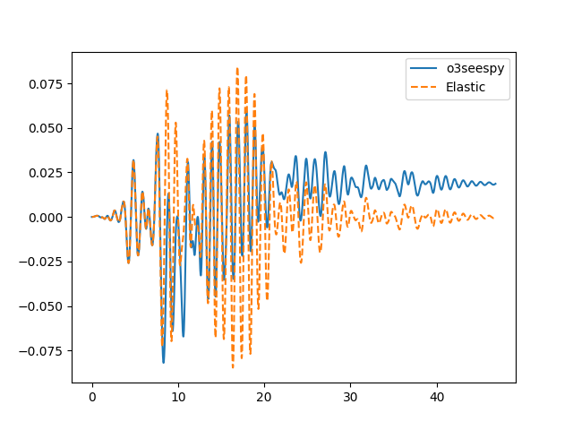

.. image:: https://travis-ci.org/eng-tools/o3seespy.svg?branch=master
   :target: https://travis-ci.org/eng-tools/o3seespy
   :alt: Testing Status

.. image:: https://img.shields.io/pypi/v/o3seespy.svg
   :target: https://pypi.python.org/pypi/o3seespy
   :alt: PyPi version

.. image:: https://coveralls.io/repos/github/eng-tools/o3seespy/badge.svg
   :target: https://coveralls.io/github/eng-tools/o3seespy

********
o3seespy
********

Object-orientated native python version of Opensees

Features
========

This package provides:

 1. A 'pythonic' version of opensees
    - all input parameters to create opensees objects are all lowercase key-value arguments
    - all class objects are CamelCase
    - static string variables defined in ALL_CAPS
    - Where possible the exact name used in the original TCL version has been kept
 2. Fully namespaced package allowing full auto-complete e.g. 'o3.uniaxial_material.Steel01(...)'
 3. Object-orientated implementation of Opensees. Python is object-orientated and the underlying opensees C++ source code is object orientated. This package replicates the underlying C++ objects.
 4. Type checking of inputs before calling C++ opensees code, so that python debugging and errors can be viewed
 5. In code documentation using python docstrings - can view the documentation within your IDE
 6. Additional features for using opensees in python:
    - saving and loading data directly from opensees into numpy arrays
    - saving and loading data directly from opensees into json files
    - Save an entire model as a json file - allows efficient passing of models between servers
 7. All object numbering handled by objects - no need for number tags!
 8. Additional logic checking of optional inputs

How to Use
==========

Installation
------------

.. code:: bash

    pip install o3seespy

Example: Inelastic SDOF
-----------------------

.. code:: python

    import numpy as np
    import matplotlib.pyplot as plt

    import openseespy.opensees as opy
    import o3seespy as o3

    from tests.conftest import TEST_DATA_DIR

    # Load a ground motion
    dt = 0.01
    rec = np.loadtxt(TEST_DATA_DIR + 'test_motion_dt0p01.txt')

    # Define inelastic SDOF
    period = 1.0  # s
    xi = 0.05
    mass = 1.0
    f_yield = 1.5  # Reduce this to make it nonlinear
    r_post = 0.0

    # Initialise OpenSees instance
    osi = o3.OpenseesInstance(ndm=2, state=0)

    # Establish nodes
    bot_node = o3.node.Node(osi, 0, 0)
    top_node = o3.node.Node(osi, 0, 0)

    # Fix bottom node
    o3.Fix(osi, top_node, o3.cc.FREE, o3.cc.FIXED, o3.cc.FIXED)
    o3.Fix(osi, bot_node, o3.cc.FIXED, o3.static.FIXED, o3.static.FIXED)
    # Set out-of-plane DOFs to be slaved
    o3.EqualDOF(osi, top_node, bot_node, [o3.static.Y, o3.static.ROTZ])

    # nodal mass (weight / g):
    o3.Mass(osi, top_node, mass, 0., 0.)

    # Define material
    k_spring = 4 * np.pi ** 2 * mass / period ** 2
    bilinear_mat = o3.uniaxial_material.Steel01(osi, fy=f_yield, e0=k_spring, b=r_post)

    # Assign zero length element, # Note: pass actual node and material objects into element
    o3.element.ZeroLength(osi, bot_node, top_node, mat_x=bilinear_mat, r_flag=1)

    # Define the dynamic analysis
    load_tag_dynamic = 1
    pattern_tag_dynamic = 1

    values = list(-1 * rec)  # should be negative
    opy.timeSeries('Path', load_tag_dynamic, '-dt', dt, '-values', *values)
    opy.pattern('UniformExcitation', pattern_tag_dynamic, o3.static.X, '-accel', load_tag_dynamic)

    # set damping based on first eigen mode
    angular_freq = opy.eigen('-fullGenLapack', 1) ** 0.5
    beta_k = 2 * xi / angular_freq
    o3.rayleigh.Rayleigh(osi, alpha_m=0.0, beta_k=beta_k, beta_k_init=0.0, beta_k_comm=0.0)

    # Run the dynamic analysis
    o3.wipe_analysis(osi)

    o3.algorithm.Newton(osi)
    o3.system.SparseGeneral(osi)
    o3.numberer.RCM(osi)
    o3.constraints.Transformation(osi)
    o3.integrator.Newmark(osi, gamma=0.5, beta=0.25)
    o3.analysis.Transient(osi)

    o3.test_check.EnergyIncr(osi, tol=1.0e-10, max_iter=10)
    analysis_time = (len(values) - 1) * dt
    analysis_dt = 0.001
    outputs = {
        "time": [],
        "rel_disp": [],
        "rel_accel": [],
        "rel_vel": [],
        "force": []
    }

    # access underlying openseespy commands to control analysis
    while opy.getTime() < analysis_time:

        opy.analyze(1, analysis_dt)
        curr_time = opy.getTime()
        outputs["time"].append(curr_time)
        outputs["rel_disp"].append(opy.nodeDisp(top_node.tag, o3.static.X))
        outputs["rel_vel"].append(opy.nodeVel(top_node.tag, o3.static.X))
        outputs["rel_accel"].append(opy.nodeAccel(top_node.tag, o3.static.X))
        opy.reactions()
        outputs["force"].append(-opy.nodeReaction(bot_node.tag, o3.static.X))  # Negative since diff node
    opy.wipe()
    for item in outputs:
        outputs[item] = np.array(outputs[item])

    plt.plot(outputs['time'], outputs['rel_disp'], label='o3seespy')
    periods = np.array([period])

    # Compare closed form elastic solution
    from eqsig import sdof
    resp_u, resp_v, resp_a = sdof.response_series(motion=rec, dt=dt, periods=periods, xi=xi)
    plt.plot(np.arange(len(rec)) * dt, resp_u[0], ls='--', label='Elastic')
    plt.legend()
    plt.show()

Useful material
===============

*

Contributing
============

How do I get set up?
--------------------

1. Run ``pip install -r requirements.txt``

Package conventions
-------------------

* All names should be the same as the opensees tcl version, except:
    - The name should be converted to snake_case for a parameter or function
    - The name should be converted to CamelCase for an Object
    - The name should be converted to ALL_CAPS for static variables
    - If the name matches a python special name (e.g. lambda, in) then it should be adjusted according to the dictionary
    - Objects should be namespaced based on the object type (e.g. element, material)
    - For parameter that are used across many objects (e.g. atmospheric pressure) a standard name should be used
    - opensees functions that collect a result are named 'get_<function-name>'
    - opensees functions that generate results are named 'gen_<function-name>'

* How should youngs modulus be named?
* Should all two node elements use i_node, j_node. Or make them all enter nodes as a list?

Testing
-------

Tests are run with pytest

* Locally run: ``pytest`` on the command line.

* Tests are run on every push using travis, see the ``.travis.yml`` file

Deployment
----------

To deploy the package to pypi.com you need to:

1. Push to the *pypi* branch. This executes the tests on circleci.com

2. Create a git tag and push to github, run: ``trigger_deploy.py`` or manually:

.. code:: bash

    git tag 0.5.2 -m "version 0.5.2"
    git push --tags origin pypi

Documentation
-------------

Built via Sphinx following: https://codeandchaos.wordpress.com/2012/07/30/sphinx-autodoc-tutorial-for-dummies/

For development mode

 1. cd to docs
 2. Run ``make html``

Docstrings follow numpy convention (in progress): https://numpydoc.readthedocs.io/en/latest/format.html

To fix long_description in setup.py: ``pip install collective.checkdocs``, ``python setup.py checkdocs``
